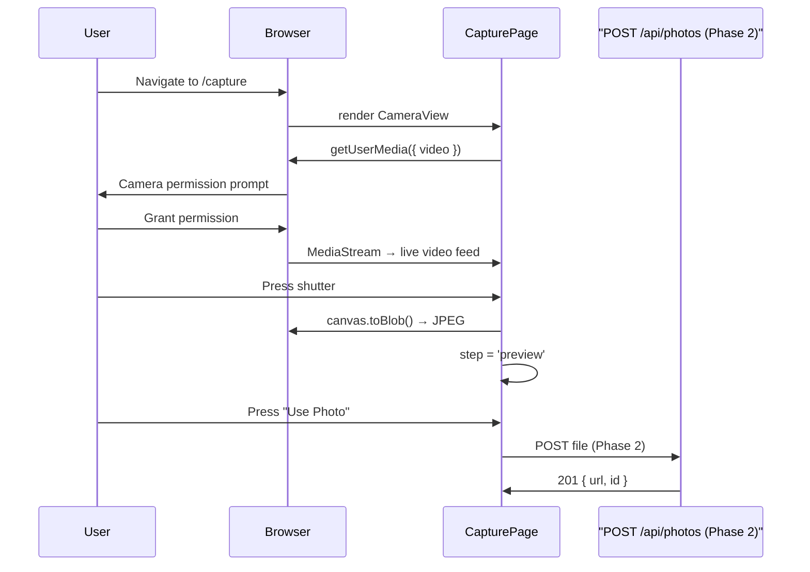

# User Story: 1 - Capture Photo via Camera

**As a** event attendee,
**I want** to open the app and use the camera to take a photo in real time,
**so that** I can quickly create a photo at a DSAC event without any setup.

## Acceptance Criteria

*   The app opens and displays a live camera feed (device camera or connected webcam).
*   A clearly visible capture button is available on the camera view.
*   Pressing the capture button takes a photo and proceeds to the preview step.
*   The camera works on mobile, tablet, and kiosk/webcam setups.
*   The app requests camera permissions gracefully and shows guidance if access is denied.

## Notes

*   Ryan mentioned supporting both device cameras and connected webcams for flexibility across mobile, tablet, and kiosk setups.
*   Keep the camera UI minimal and intuitive to suit fast-paced event environments.

---

## Story Status

```
Story: 01 - Capture Photo via Camera
Story Status: [x] Completed

Task: Phase 1 UI Implementation
Task Status: [x] Completed

Task: Testing Setup (Vitest + Playwright)
Task Status: [x] Completed

Task: Phase 2 API Integration
Task Status: [x] Completed (stub endpoint ready; storage integration deferred)
```

---

## Implementation Plan

### 1. Feature Overview

- **Goal:** Provide a minimal, full-screen camera capture flow — open device camera or webcam, show a live feed, capture a JPEG frame, and display it in a preview step (confirm / retake).
- **Primary user role:** Event attendee

---

### 2. Component Analysis & Reuse Strategy

| Component | Decision | Justification |
|-----------|----------|---------------|
| `app/page.tsx` | Modify | Replace boilerplate with DSAC landing page linking to `/capture` |
| `app/layout.tsx` | Reuse as-is | Global layout sufficient |
| `CameraView` | **Create** | No existing camera component; browser MediaDevices API requires Client Component |
| `PhotoPreview` | **Create** | New feature; client-side state and interactions needed |
| `CaptureButton` | **Create** | Reusable shutter UI; can be shared across future capture flows |

---

### 3. Affected Files

```
[CREATE] types/capture.ts
[CREATE] components/ui/CaptureButton.tsx
[CREATE] components/features/capture-photo/CameraView.tsx
[CREATE] components/features/capture-photo/PhotoPreview.tsx
[CREATE] app/capture/page.tsx
[MODIFY] app/page.tsx
[CREATE] components/features/capture-photo/CameraView.test.tsx      (Phase 1 — needs test framework)
[CREATE] components/features/capture-photo/CameraView.visual.spec.ts (Phase 1 — needs Playwright)
[CREATE] components/features/capture-photo/CameraView.e2e.spec.ts    (Phase 1 — needs Playwright)
[CREATE] app/api/photos/route.ts                                      (Phase 2)
```

> ⚠️ No testing framework (Jest/Vitest/Playwright) is present in `package.json`. Test file stubs are deferred until a test framework is installed.

---

### 4. Component Breakdown

#### `CameraView` — `components/features/capture-photo/CameraView.tsx`
- **Type:** Client Component (`"use client"`) — uses `useRef`, `useEffect`, `getUserMedia`
- **Responsibility:** Request camera permission, stream video, capture frame, surface errors
- **Props:**
  ```ts
  interface CameraViewProps {
    facingMode?: 'user' | 'environment';
    onCapture: (blob: Blob, dataUrl: string) => void;
    onError?: (error: Error) => void;
    className?: string;
  }
  ```
- **Children:** `CaptureButton`, inline permission notice

#### `PhotoPreview` — `components/features/capture-photo/PhotoPreview.tsx`
- **Type:** Client Component
- **Responsibility:** Show captured frame with Confirm / Retake actions
- **Props:**
  ```ts
  interface PhotoPreviewProps {
    imageUrl: string;  // data URL
    onConfirm: () => void;
    onRetake: () => void;
  }
  ```

#### `CaptureButton` — `components/ui/CaptureButton.tsx`
- **Type:** Client Component
- **Responsibility:** Accessible circular shutter button
- **Props:** `onClick`, `disabled?`, `ariaLabel?`

#### `app/capture/page.tsx`
- **Type:** Client Component (manages `step` and `captured` state)
- **Responsibility:** Orchestrate camera → preview flow; Phase 2 will POST to API

---

### 5. Design Specifications

> No Figma link provided. Colors use the project's dark/gaming theme tokens:

| Hex | Purpose | Element |
|-----|---------|---------|
| `#0B0F14` | Page background | All roots and overlays |
| `#00E5FF` | Primary accent (neon cyan) | Capture button ring, confirm button, focus rings |
| `#FFFFFF` | Primary text | Headings, error messages |
| `#9AA4B2` | Secondary text | Hints, guidance messages, retake button |

- Capture button: 72×72 px (desktop), 64×64 (tablet), circular with 4 px `#00E5FF` border and 56×56 inner disc
- Controls bar padding: 24 px (py-6)
- Container: full viewport (`h-dvh`); video flex-1

---

### 6. Data Flow & State Management

```ts
// types/capture.ts
export interface CapturedPhoto {
  id?: string;
  dataUrl: string;
  blob?: Blob;
  width?: number;
  height?: number;
  createdAt?: string;
}
```

- **Phase 1:** All state is local — `step: 'camera' | 'preview'` and `captured: CapturedPhoto | null` in `CapturePage`.
- **Phase 2:** `handleConfirm` in `CapturePage` will `POST captured.blob` to `/api/photos`.
- No Zustand required for this scope.

---

### 7. API Endpoints & Contracts (Phase 2)

**`POST /api/photos`** — `app/api/photos/route.ts`

```yaml
POST /api/photos
requestBody:
  content:
    multipart/form-data:
      schema:
        type: object
        properties:
          file: { type: string, format: binary }
        required: [file]
responses:
  201:
    application/json:
      schema:
        properties:
          id: string
          url: string
          createdAt: string
  400: { description: Invalid payload }
  429: { description: Rate limit exceeded }
```

---

### 8. Integration Diagram



---

### 9. Styling

- All colors applied as **direct hex values** via Tailwind arbitrary syntax: `bg-[#00E5FF]`, `text-[#FFFFFF]`, etc.
- No Tailwind config token changes made.
- Layout uses Tailwind utilities: `flex`, `h-dvh`, `items-center`, `justify-center`, `py-6`, `gap-6`.
- Responsive specifics: `sm:h-16 sm:w-16` scales the capture button down on smaller viewports.

---

### 10. Testing Strategy

> ✅ Test framework installed: `vitest`, `@testing-library/react`, `@testing-library/jest-dom`, `@playwright/test`
>
> Run unit tests: `npm run test:run`  
> Run e2e / visual tests: `npm run test:e2e` (requires the Vite server running)

- **Unit / Component tests** (Vitest + Testing Library):
  - `components/features/capture-photo/CameraView.test.tsx`
    - Mock `navigator.mediaDevices.getUserMedia` for granted/denied paths
    - Assert permission notice renders on denial
    - Assert `onCapture` callback called with Blob + dataUrl on shutter press
  - `components/features/capture-photo/PhotoPreview.test.tsx`
    - Assert image src equals passed `imageUrl`
    - Assert `onConfirm` / `onRetake` fire on button clicks

- **Playwright visual** (`CameraView.visual.spec.ts`):
  - Viewports: 375×667, 768×1024, 1280×800, 1920×1080
  - Assert computed `background-color` on `[data-testid="capture-camera-root"]` = `rgb(11, 15, 20)`
  - Assert capture button computed size = 72px / 64px per viewport
  - Assert border-color = `rgb(0, 229, 255)`
  - Assert text color on error notice = `rgb(255, 255, 255)`

- **Playwright e2e** (`CameraView.e2e.spec.ts`):
  - Grant camera permission via Playwright context `grantPermissions`
  - Verify video element plays and is not hidden
  - Click shutter → assert `photo-preview-root` is visible
  - Click Retake → assert back to camera view

---

### 11. Accessibility (A11y)

- `CaptureButton` has `aria-label` (default: "Take photo") and keyboard focus ring
- Permission error rendered in `role="alert"` + `aria-live="assertive"` region
- `video` element is `muted` and captures no audio
- All interactive elements reachable via Tab; focus-visible ring uses `#00E5FF` on `#0B0F14` background (contrast ratio > 4.5:1)

---

### 12. Security Considerations

- Camera is only accessed when user navigates to `/capture` (no ambient permission requests)
- Audio explicitly excluded: `audio: false` in `getUserMedia` constraints
- Phase 2 upload endpoint must: validate MIME type (accept only `image/jpeg`/`image/png`), enforce max file size (`< 10 MB`), rate-limit per session/IP

---

### 13. Implementation Steps

**Phase 1 — UI Implementation with Mock Data**

- [x] Create `types/capture.ts` with `CapturedPhoto` interface
- [x] Create `components/ui/CaptureButton.tsx`
- [x] Create `components/features/capture-photo/CameraView.tsx`
- [x] Create `components/features/capture-photo/PhotoPreview.tsx`
- [x] Create `app/capture/page.tsx` — orchestrates camera → preview flow
- [x] Update `app/page.tsx` — DSAC landing page with "Start Camera" link to `/capture`
- [x] Apply dark gaming palette via direct hex values throughout
- [x] Add `data-testid` attributes to all key elements
- [x] Add graceful camera permission error guidance with retry
- [x] Install test framework (Vitest + Playwright)
- [x] Write `CameraView.test.tsx` unit tests (8 tests — permission grant/deny, error states, shutter capture)
- [x] Write `PhotoPreview.test.tsx` unit tests (6 tests — rendering, confirm/retake callbacks)
- [x] Write `CameraView.visual.spec.ts` Playwright visual assertions (4 viewports, computed-style assertions)
- [x] Write `CameraView.e2e.spec.ts` Playwright flow tests (5 scenarios)
- [ ] Manual accessibility audit (keyboard nav, ARIA, contrast)
- [ ] Manual device / browser testing (mobile, tablet, webcam kiosk)

**Phase 2 — API Integration with Real Data**

- [x] Create `app/api/photos/route.ts` (POST endpoint, MIME validation, 10 MB size limit)
- [ ] Add DB schema if persistent storage required; update `docs/erd.md`
- [x] Replace `handleConfirm` stub in `app/capture/page.tsx` with real API call + error handling
- [x] Add loading state (`isConfirming`) on confirm button during upload
- [ ] Write API unit tests
- [ ] Update component tests to mock API calls
- [ ] E2E test: capture photo → upload → verify response URL

---

### References

- Story file: [docs/stories/01-capture-photo.md](docs/stories/01-capture-photo.md)
- Types: [types/capture.ts](types/capture.ts)
- Capture route: [app/capture/page.tsx](app/capture/page.tsx)
- Camera component: [components/features/capture-photo/CameraView.tsx](components/features/capture-photo/CameraView.tsx)
- Preview component: [components/features/capture-photo/PhotoPreview.tsx](components/features/capture-photo/PhotoPreview.tsx)
- Shutter button: [components/ui/CaptureButton.tsx](components/ui/CaptureButton.tsx)
- Entry page: [app/page.tsx](app/page.tsx)
