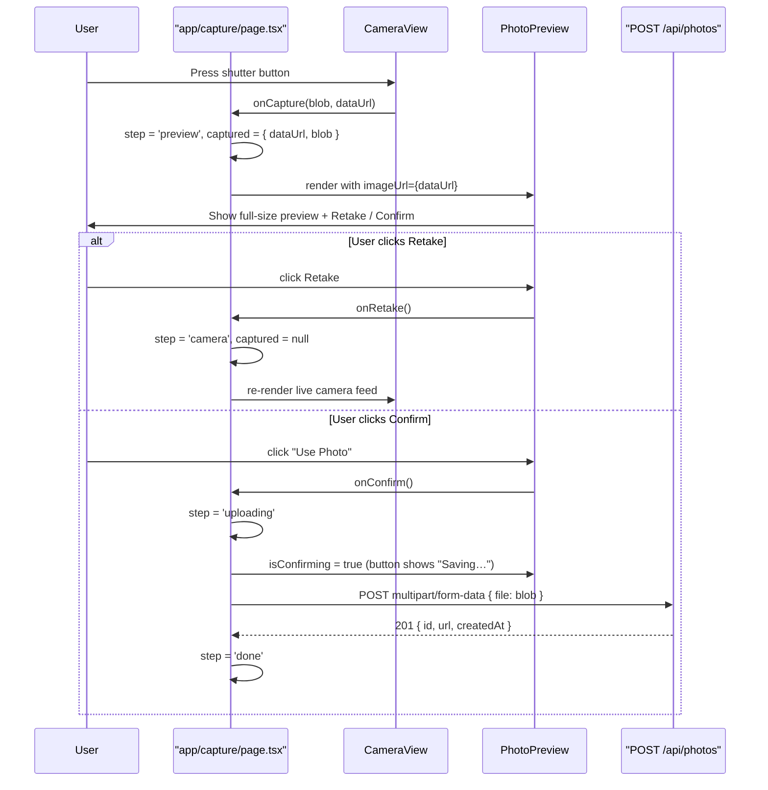

# User Story: 2 - Preview and Retake Photo

**As a** event attendee,
**I want** to see an immediate preview of my captured photo and have the option to retake it,
**so that** I can make sure the photo looks good before it is finalized.

## Acceptance Criteria

*   After capture, the app displays a clear, full-size preview of the photo.
*   Two primary actions are presented: **Retake** and **Confirm**.
*   Selecting **Retake** returns the user to the live camera view to capture a new photo.
*   Selecting **Confirm** advances the user to the image composition step.
*   The user can retake as many times as needed with no limit.

## Notes

*   Buttons should be large and prominent for easy use in event/kiosk settings.

---

## Story Status

```
Story: 02 - Preview and Retake Photo
Story Status: [x] Completed

Task: Phase 1 — Visual & E2E Tests
Task Status: [x] Completed

Task: Phase 2 — API Integration
Task Status: [x] Completed (inherited from Story 1)
```

---

## Implementation Plan

### 1. Feature Overview

- **Goal:** After the shutter fires, immediately show the captured JPEG in a full-size preview screen with two primary actions — **Retake** (return to live camera) and **Confirm** (advance to image composition). The user may retake without limit.
- **Primary user role:** Event attendee

---

### 2. Component Analysis & Reuse Strategy

| Component | Location | Decision | Justification |
|-----------|----------|----------|---------------|
| `PhotoPreview` | `components/features/capture-photo/PhotoPreview.tsx` | **Reuse as-is** | Already implements full-size preview image, Retake button, and Confirm ("Use Photo") button with `isConfirming` loading state. All acceptance criteria are met. |
| `CameraView` | `components/features/capture-photo/CameraView.tsx` | **Reuse as-is** | Captures the photo blob/dataUrl and surfaces `onCapture`; no changes required for this story. |
| `app/capture/page.tsx` | `app/capture/page.tsx` | **Reuse as-is** | Orchestrates the `camera → preview` step transition via `handleCapture`, `handleRetake`, `handleConfirm`. Flow already satisfies all acceptance criteria. |
| `CaptureButton` | `components/ui/CaptureButton.tsx` | **Reuse as-is** | Not directly involved in the preview step. |
| `PhotoPreview.test.tsx` | `components/features/capture-photo/PhotoPreview.test.tsx` | **Reuse as-is** | Six unit tests already cover rendering, `onConfirm`, `onRetake` callbacks, and label text. |
| `PhotoPreview.visual.spec.ts` | `components/features/capture-photo/PhotoPreview.visual.spec.ts` | **Create** | No Playwright visual test exists for the preview screen. Needed to verify colors, spacing, typography, and responsive layout across all required viewports. |
| `CameraView.e2e.spec.ts` | `components/features/capture-photo/CameraView.e2e.spec.ts` | **Modify** | Existing E2E tests cover the capture → preview → retake path. Needs additional test for the `isConfirming` button state during upload. |

> **Gaps identified:** The sole gap is the missing `PhotoPreview.visual.spec.ts`. All functional/unit coverage already exists.

---

### 3. Affected Files

```
[REUSE]  components/features/capture-photo/PhotoPreview.tsx
[REUSE]  components/features/capture-photo/PhotoPreview.test.tsx
[REUSE]  app/capture/page.tsx
[CREATE] components/features/capture-photo/PhotoPreview.visual.spec.ts
[MODIFY] components/features/capture-photo/CameraView.e2e.spec.ts
```

---

### 4. Component Breakdown

#### `PhotoPreview` — `components/features/capture-photo/PhotoPreview.tsx` *(Reuse as-is)*

- **Type:** Client Component (`"use client"`)
- **Responsibility:** Render the captured photo full-size and surface Retake / Confirm actions
- **Current props (TypeScript interface):**
  ```ts
  export interface PhotoPreviewProps {
    imageUrl: string;       // JPEG data URL from canvas capture
    onConfirm: () => void;  // advances to composition step
    onRetake: () => void;   // returns to live camera
    isConfirming?: boolean; // true while upload is in-flight (Phase 2)
  }
  ```
- **Key `data-testid` attributes already present:**
  - `photo-preview-root` — outermost container
  - `photo-preview-image` — `` element
  - `photo-preview-controls` — button row wrapper
  - `photo-preview-retake` — Retake button
  - `photo-preview-confirm` — Confirm ("Use Photo") button
- **No changes required.** All acceptance criteria are satisfied by the current implementation.

#### `app/capture/page.tsx` *(Reuse as-is)*

- **Type:** Client Component
- **Relevant state:**
  ```ts
  type Step = 'camera' | 'preview' | 'uploading' | 'done';
  const [step, setStep] = useState<Step>('camera');
  const [captured, setCaptured] = useState<CapturedPhoto | null>(null);
  ```
- `handleCapture` → sets `step = 'preview'`
- `handleRetake` → sets `step = 'camera'` (unlimited retakes ✅)
- `handleConfirm` → sets `step = 'uploading'`, then POSTs to `/api/photos`
- No changes required.

---

### 5. Design Specifications

> No Figma link provided. All values reverse-engineered from the implemented `PhotoPreview.tsx` and the project's dark/gaming design system.

#### Color Table

| Design Color | Semantic Purpose | Element | Implementation Method |
|---|---|---|---|
| `#0B0F14` | Page / panel background | `photo-preview-root` root div | `bg-[#0B0F14]` |
| `#FFFFFF` | Image alt text fallback | `` alt attribute | n/a (text fallback only) |
| `#9AA4B2` | Retake button default state | Border and label text | `border-[#9AA4B2] text-[#9AA4B2]` |
| `#FFFFFF` | Retake button hover state | Border and label text | `hover:border-[#FFFFFF] hover:text-[#FFFFFF]` |
| `#00E5FF` | Confirm button background / focus ring | Button fill, all focus rings | `bg-[#00E5FF]`, `focus-visible:ring-[#00E5FF]` |
| `#33ECFF` | Confirm button hover background | Hover fill | `hover:bg-[#33ECFF]` |
| `#0B0F14` | Confirm button label text | Text on cyan fill | `text-[#0B0F14]` |

#### Spacing & Layout

| Property | Value | Tailwind Class |
|---|---|---|
| Controls row vertical padding | 24 px (top & bottom) | `py-6` |
| Controls row horizontal padding | 16 px (left & right) | `px-4` |
| Gap between Retake and Confirm buttons | 24 px | `gap-6` |
| Max button width | 160 px | `max-w-[160px]` |
| Button vertical padding | 12 px (top & bottom) | `py-3` |
| Button border radius | full (pill) | `rounded-full` |

#### Typography

| Element | Size | Weight | Notes |
|---|---|---|---|
| Retake button label | `text-base` (16 px / 1 rem) | `font-medium` (500) | |
| Confirm button label ("Use Photo" / "Saving…") | `text-base` (16 px / 1 rem) | `font-semibold` (600) | |

#### Visual Hierarchy (containment)

```
photo-preview-root  (flex col, full viewport, bg #0B0F14)
├── image container  (flex-1, overflow-hidden, center)
│   └── photo-preview-image  (max-w-full max-h-full, object-contain)
└── photo-preview-controls  (flex row, center, py-6 px-4, gap-6)
    ├── photo-preview-retake  (flex-1, max-w-[160px], rounded-full, bordered)
    └── photo-preview-confirm  (flex-1, max-w-[160px], rounded-full, filled cyan)
```

#### Visual Verification Checklist

- [ ] Root background is `rgb(11, 15, 20)` (`#0B0F14`)
- [ ] Image fills available space without cropping (object-contain)
- [ ] Retake button border color is `rgb(154, 164, 178)` (`#9AA4B2`)
- [ ] Retake button text color is `rgb(154, 164, 178)` (`#9AA4B2`)
- [ ] Confirm button background is `rgb(0, 229, 255)` (`#00E5FF`)
- [ ] Confirm button text is `rgb(11, 15, 20)` (`#0B0F14`)
- [ ] Both buttons are pill-shaped (border-radius ≥ 9999 px)
- [ ] Both buttons are `flex-1` up to 160 px wide
- [ ] Controls row has 24 px gap between buttons
- [ ] `isConfirming=true` → Confirm button shows "Saving…" and is disabled
- [ ] `isConfirming=true` → Retake button is disabled (opacity ~0.4)

---

### 6. Data Flow & State Management

All state is local to `app/capture/page.tsx`. No Zustand or external store required.

```ts
// types/capture.ts  (already exists — no changes needed)
export interface CapturedPhoto {
  id?: string;
  dataUrl: string;   // passed as imageUrl to PhotoPreview
  blob?: Blob;       // used for Phase 2 upload
  width?: number;
  height?: number;
  createdAt?: string;
}
```

**Data flow — preview step:**

1. `CameraView.handleCapture(blob, dataUrl)` →
2. `CapturePage.handleCapture` sets `captured = { dataUrl, blob, createdAt }`, `step = 'preview'` →
3. `PhotoPreview` receives `imageUrl={captured.dataUrl}` →
4. **Retake path:** `onRetake` → `setCaptured(null)`, `step = 'camera'`
5. **Confirm path:** `onConfirm` → `step = 'uploading'` → POST → `step = 'done'` || `step = 'preview'` + error

---

### 7. API Endpoints & Contracts

No new API endpoints required for this user story. The existing `POST /api/photos` route (created in Story 1) is invoked by `handleConfirm` in `app/capture/page.tsx`. See Story 1 implementation plan for the full contract.

---

### 8. Integration Diagram



---

### 9. Styling

All visual properties use **direct hex values** via Tailwind's arbitrary-value syntax. No theme token modifications required.

| Property | Design Value | Tailwind Implementation |
|---|---|---|
| Root background | `#0B0F14` | `bg-[#0B0F14]` |
| Retake border (default) | `#9AA4B2` | `border-[#9AA4B2]` |
| Retake text (default) | `#9AA4B2` | `text-[#9AA4B2]` |
| Retake border (hover) | `#FFFFFF` | `hover:border-[#FFFFFF]` |
| Retake text (hover) | `#FFFFFF` | `hover:text-[#FFFFFF]` |
| Confirm background | `#00E5FF` | `bg-[#00E5FF]` |
| Confirm background (hover) | `#33ECFF` | `hover:bg-[#33ECFF]` |
| Confirm text | `#0B0F14` | `text-[#0B0F14]` |
| All focus rings | `#00E5FF` | `focus-visible:ring-[#00E5FF]` |
| Confirm glow shadow | `rgba(0,229,255,0.25)` | `shadow-[0_6px_20px_rgba(0,229,255,0.25)]` |
| Transition | 150 ms | `transition-colors duration-150` |

**Responsiveness:** Both buttons use `flex-1 max-w-[160px]` so they scale naturally on mobile while remaining capped in width on larger screens. The controls row uses `py-6` for the 24 px tap target breathing room required in kiosk/event settings.

---

### 10. Testing Strategy

Follow the same patterns established in Story 1.

**Unit / Component tests (Vitest + Testing Library):**

- `components/features/capture-photo/PhotoPreview.test.tsx` *(already complete — 6 tests)*

**Playwright visual tests:**

- `[CREATE] components/features/capture-photo/PhotoPreview.visual.spec.ts`
  - Test across all four viewports: 375×667, 768×1024, 1280×800, 1920×1080
  - Assert computed `backgroundColor` on `[data-testid="photo-preview-root"]` = `rgb(11, 15, 20)`
  - Assert `[data-testid="photo-preview-image"]` is visible
  - Assert Retake button `borderTopColor` = `rgb(154, 164, 178)`
  - Assert Retake button `color` = `rgb(154, 164, 178)`
  - Assert Confirm button `backgroundColor` = `rgb(0, 229, 255)`
  - Assert Confirm button `color` = `rgb(11, 15, 20)`
  - Assert Retake button text = "Retake"
  - Assert Confirm button text = "Use Photo"
  - Assert both buttons are visible and within controls row
  - Assert `isConfirming` state: Confirm shows "Saving…" and is disabled
  - Collect all discrepancies before failing (no screenshot diffing)

**Playwright E2E tests:**

- `[MODIFY] components/features/capture-photo/CameraView.e2e.spec.ts`
  - Add: confirm button click → `step = 'uploading'` → button shows "Saving…" and is disabled
  - Existing retake test already covers the Retake path ✅

**Key `data-testid` attributes (all already present):**

| Element | `data-testid` |
|---|---|
| Root container | `photo-preview-root` |
| Preview image | `photo-preview-image` |
| Controls row | `photo-preview-controls` |
| Retake button | `photo-preview-retake` |
| Confirm button | `photo-preview-confirm` |

---

### 11. Accessibility (A11y) Considerations

- Both buttons use semantic `<button type="button">` elements — keyboard accessible and screen-reader announced
- Confirm button text changes to "Saving…" during upload — screen readers will announce the change; consider `aria-live="polite"` on the button wrapper if a screen reader audit reveals the label change is not reliably announced
- `disabled` attribute is applied to both buttons during `isConfirming` — prevents double-submit and provides visual (opacity) feedback
- Both buttons have a visible `focus-visible:ring-2 ring-[#00E5FF]` focus indicator; `#00E5FF` on `#0B0F14` achieves a contrast ratio > 4.5:1
- Image has `alt="Captured photo preview"` for screen readers
- No autoplay, no audio

---

### 12. Security Considerations

- The `imageUrl` prop is a `data:image/jpeg;base64,...` data URL generated in-browser by `canvas.toDataURL`. It is never constructed from user-supplied strings, eliminating XSS injection risk via URL.
- The `onConfirm` handler POSTs the `Blob` to `/api/photos`; the existing route validates MIME type and enforces a 10 MB size cap — no additional measures needed at the component level.
- No sensitive data (tokens, PII) is embedded in the preview URL.

---

### 13. Implementation Steps

**Implementation Checklist:**

**Phase 1: UI Implementation (Component & Visual Tests)**

**1. Verify existing implementation satisfies all acceptance criteria:**
- [x] Confirm `PhotoPreview.tsx` renders a full-size preview image ✅
- [x] Confirm Retake button returns to live camera feed ✅
- [x] Confirm Confirm button ("Use Photo") fires `onConfirm` ✅
- [x] Confirm unlimited retake cycles work end-to-end ✅
- [x] Confirm buttons are large and prominent (pill shape, `py-3 flex-1`) ✅

**2. Visual Tests — PhotoPreview:**
- [x] Create `components/features/capture-photo/PhotoPreview.visual.spec.ts`
- [x] Implement `COLORS` constants matching design tokens (`#0B0F14`, `#9AA4B2`, `#00E5FF`, `#0B0F14`)
- [x] Implement `VIEWPORTS` array: 375×667, 768×1024, 1280×800, 1920×1080
- [x] Implement `collectIssues()` helper that gathers all failures before asserting
- [x] Add check: root `backgroundColor` = `rgb(11, 15, 20)`
- [x] Add check: `photo-preview-image` is visible
- [x] Add check: Retake button `borderTopColor` = `rgb(154, 164, 178)`
- [x] Add check: Retake button `color` = `rgb(154, 164, 178)`
- [x] Add check: Confirm button `backgroundColor` = `rgb(0, 229, 255)`
- [x] Add check: Confirm button `color` = `rgb(11, 15, 20)`
- [x] Add check: Retake label text = "Retake"
- [x] Add check: Confirm label text = "Use Photo"
- [x] Add `isConfirming` state test: intercept upload with `page.route`, verify "Saving…" label + `disabled` on both buttons
- [ ] Run visual tests across all 4 viewports: `npm run test:e2e -- PhotoPreview.visual.spec.ts`

**3. E2E Test — Confirm loading state:**
- [x] Add test to `CameraView.e2e.spec.ts`: after shutter press, intercept `/api/photos` with slow response, verify confirm button shows "Saving…" and is disabled
- [x] Verify Retake button is also disabled during `isConfirming`

**4. Manual QA:**
- [ ] Test on mobile (375 px): buttons fill available width, tap targets ≥ 48 px
- [ ] Test on desktop (1280 px): buttons capped at 160 px, controls row centered
- [ ] Keyboard navigation: Tab reaches Retake then Confirm, Enter fires each
- [ ] Screen reader smoke-test: confirm label change to "Saving…" is announced

**Phase 2: API Integration (already complete from Story 1)**

**5. Verify integration is complete:**
- [x] `handleConfirm` in `app/capture/page.tsx` POSTs to `/api/photos` ✅
- [x] `isConfirming` (`step === 'uploading'`) is passed to `PhotoPreview` ✅
- [x] Upload error displayed via `data-testid="upload-error"` `role="alert"` ✅
- [x] On success, `step = 'done'` and "Take another" resets the session ✅

---

### References

- [User Story 1 — Capture Photo via Camera](./01-capture-photo.md) — establishes all shared components, types, and the API contract this story depends on
- `components/features/capture-photo/PhotoPreview.tsx` — existing component implementing the preview/retake screen
- `app/capture/page.tsx` — orchestrates camera → preview step transitions
- `components/features/capture-photo/CameraView.visual.spec.ts` — reference pattern for Playwright visual tests (collectIssues helper, viewport loop, computed-style assertions)
- `components/features/capture-photo/CameraView.e2e.spec.ts` — reference pattern for Playwright E2E tests
