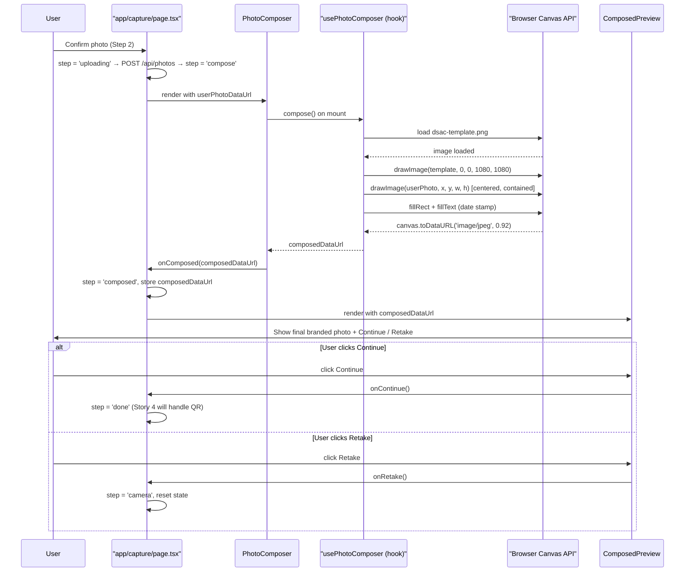

# User Story: 3 - Compose Branded Event Photo

**As a** event attendee,
**I want** my confirmed photo to be automatically composed with a DSAC-branded background and the current date,
**so that** I receive a polished, commemorative event photo ready for download.

## Acceptance Criteria

*   Upon confirming the photo, the app overlays the user's photo onto a predefined DSAC-themed background template.
*   The DSAC branding (logo and visual elements) is visible and not obscured by the user's photo.
*   The current date is stamped onto the final composition in a readable format.
*   The date placement does not obscure important parts of the photo or branding.
*   The final composed image is exported as a common format (e.g., JPEG or PNG) at quality suitable for sharing.

## Notes

*   Version one uses a single predefined DSAC template (DSAC logo, data-themed or futuristic graphics).
*   Future versions may support multiple templates, filters, face-alignment guides, and configurable event names.
*   Date format and position can be refined in later iterations.

---

## Implementation Plan

### 1. Feature Overview

- **Goal:** After the user confirms their photo, automatically compose it with a predefined DSAC-branded background template and a date stamp using an in-browser HTML Canvas pipeline, then export the final image as a JPEG data URL ready for download or further processing (Story 4 — QR code).
- **Primary user role:** Event attendee

---

### 2. Component Analysis & Reuse Strategy

| Component | Location | Decision | Justification |
|-----------|----------|----------|---------------|
| `app/capture/page.tsx` | `app/capture/page.tsx` | **Modify** | Add a new `compose` step between `uploading` and `done`; wire the composition result into the page state for Story 4 handoff. |
| `PhotoComposer` | `components/features/compose-photo/PhotoComposer.tsx` | **Create** | New canvas-based composition component. Encapsulates all canvas drawing logic; surfaces the composed data URL via `onComposed` callback. |
| `ComposedPreview` | `components/features/compose-photo/ComposedPreview.tsx` | **Create** | Shows the final composed JPEG with a full-screen preview; client component used in the `composed` step. |
| `usePhotoComposer` | `components/features/compose-photo/usePhotoComposer.ts` | **Create** | Custom hook that performs the Canvas composition (background → user photo → date stamp) and returns `{ composedDataUrl, isComposing, error }`. |
| `PhotoPreview` | `components/features/capture-photo/PhotoPreview.tsx` | **Reuse as-is** | No changes; `onConfirm` already triggers `handleConfirm` which transitions the step. |
| `CameraView` | `components/features/capture-photo/CameraView.tsx` | **Reuse as-is** | No changes needed for this story. |
| `types/capture.ts` | `types/capture.ts` | **Modify** | Add `composedDataUrl?: string` to `CapturedPhoto` to carry the composed image into Story 4. |

> **Gaps:** No canvas composition utilities exist. A DSAC background template image must be added to `public/`.

---

### 3. Affected Files

```
[MODIFY]  app/capture/page.tsx
[MODIFY]  types/capture.ts
[CREATE]  public/dsac-template.png
[CREATE]  components/features/compose-photo/usePhotoComposer.ts
[CREATE]  components/features/compose-photo/PhotoComposer.tsx
[CREATE]  components/features/compose-photo/ComposedPreview.tsx
[CREATE]  components/features/compose-photo/usePhotoComposer.test.ts
[CREATE]  components/features/compose-photo/PhotoComposer.test.tsx
[CREATE]  components/features/compose-photo/ComposedPreview.test.tsx
[CREATE]  components/features/compose-photo/ComposedPreview.visual.spec.ts
[CREATE]  components/features/compose-photo/ComposedPreview.e2e.spec.ts
```

---

### 4. Component Breakdown

#### `usePhotoComposer` — `components/features/compose-photo/usePhotoComposer.ts`

- **Type:** Custom React hook (client-side only)
- **Responsibility:** Load the DSAC background image, draw it as the canvas background, composite the user's photo scaled to fill the photo region, then render the date stamp; resolve to a JPEG data URL.
- **Signature:**
  ```ts
  interface UsePhotoComposerOptions {
    userPhotoDataUrl: string | null;
    templateUrl?: string;          // default: '/dsac-template.png'
    outputWidth?: number;          // default: 1080
    outputHeight?: number;         // default: 1080
    dateFormat?: Intl.DateTimeFormatOptions; // default: { year: 'numeric', month: 'long', day: 'numeric' }
  }

  interface UsePhotoComposerResult {
    composedDataUrl: string | null;
    isComposing: boolean;
    error: Error | null;
    compose: () => Promise<void>;  // trigger composition manually
  }
  ```
- **Canvas composition steps (executed inside `compose()`):**
  1. Create `OffscreenCanvas` (or regular `HTMLCanvasElement` as fallback) at `outputWidth × outputHeight`
  2. Draw DSAC background template stretched to canvas size
  3. Draw user photo centered, fitting within a "photo zone" inset (e.g., 60 px padding on all sides); `object-fit: contain` semantics
  4. Draw date string (bottom-right corner, 8 px from edges) with a semi-transparent backing rect for legibility

#### `PhotoComposer` — `components/features/compose-photo/PhotoComposer.tsx`

- **Type:** Client Component (`"use client"`)
- **Responsibility:** "Spinner / composing" interstitial screen — renders while `usePhotoComposer` is in-flight, automatically calls `compose()` on mount, then calls `onComposed(dataUrl)` once complete.
- **Props:**
  ```ts
  export interface PhotoComposerProps {
    userPhotoDataUrl: string;
    onComposed: (composedDataUrl: string) => void;
    onError: (error: Error) => void;
    templateUrl?: string;
  }
  ```
- **Key `data-testid` attributes:**
  - `photo-composer-root` — outermost container
  - `photo-composer-spinner` — loading indicator
  - `photo-composer-error` — error message (conditional)

#### `ComposedPreview` — `components/features/compose-photo/ComposedPreview.tsx`

- **Type:** Client Component (`"use client"`)
- **Responsibility:** Show the final composed image to the user; provides a "Continue" action (advances to Story 4 — QR code download) and a "Retake" fallback.
- **Props:**
  ```ts
  export interface ComposedPreviewProps {
    composedDataUrl: string;
    capturedAt: string;           // ISO string for metadata display
    onContinue: () => void;       // advance to QR code step
    onRetake: () => void;         // reset all the way back to camera
  }
  ```
- **Key `data-testid` attributes:**
  - `composed-preview-root` — outermost container
  - `composed-preview-image` — `` of the composed JPEG
  - `composed-preview-controls` — button row
  - `composed-preview-continue` — "Continue" (→ QR code)
  - `composed-preview-retake` — "Retake" (→ camera)

#### `app/capture/page.tsx` *(Modify)*

- Add `'compose' | 'composed'` to the `Step` union
- Add `composedDataUrl: string | null` state
- Add `handleComposed(dataUrl: string)` → stores result, `step = 'composed'`
- Add `handleComposeError(err: Error)` → sets error message, falls back to `step = 'preview'`
- Render `<PhotoComposer>` when `step === 'compose'`
- Render `<ComposedPreview>` when `step === 'composed'`
- Change `handleConfirm` success path from `step = 'done'` → `step = 'compose'`

#### `types/capture.ts` *(Modify)*

```ts
export interface CapturedPhoto {
  id?: string;
  dataUrl: string;
  blob?: Blob;
  width?: number;
  height?: number;
  createdAt?: string;
  composedDataUrl?: string;  // ← ADD: canvas-composed JPEG data URL
}
```

---

### 5. Design Specifications

> No Figma link provided. Design values follow the established DSAC dark/gaming palette.

#### Color Table

| Design Color | Semantic Purpose | Element | Implementation Method |
|---|---|---|---|
| `#0B0F14` | Page / panel background | `photo-composer-root`, `composed-preview-root` | `bg-[#0B0F14]` |
| `#00E5FF` | Primary accent — spinner ring, Continue button | Spinner border, button fill | `border-[#00E5FF]`, `bg-[#00E5FF]` |
| `#33ECFF` | Continue button hover | Hover state | `hover:bg-[#33ECFF]` |
| `#0B0F14` | Continue button text | Text on cyan fill | `text-[#0B0F14]` |
| `#9AA4B2` | Retake button default state | Border and label | `border-[#9AA4B2] text-[#9AA4B2]` |
| `#FFFFFF` | Retake button hover; composing label | Hover border/text; spinner text | `hover:border-[#FFFFFF] hover:text-[#FFFFFF]`, `text-[#FFFFFF]` |
| `#FFFFFF` | Date stamp text (canvas) | Canvas `fillText` | Direct hex in Canvas API |
| `rgba(0,0,0,0.45)` | Date stamp backing rect (canvas) | Canvas `fillRect` behind date | Direct rgba in Canvas API |

#### Canvas Composition Layout

```
┌─────────────────────────────────────────────────────┐  1080 × 1080 px
│  DSAC background template (stretched to fill)        │
│  ┌─────────────────────────────────────────────┐     │
│  │                                             │ ←60px│
│  │      User photo (object-contain, centered)  │ inset│
│  │                                             │      │
│  └─────────────────────────────────────────────┘      │
│                               ┌────────────────────┐  │
│                               │  26 March 2026     │ ←│ 8px from bottom-right
│                               └────────────────────┘  │
└─────────────────────────────────────────────────────┘
```

#### Spacing & Layout (Composer interstitial screen)

| Property | Value | Tailwind Class |
|---|---|---|
| Spinner outer border | 4 px | `border-4` |
| Spinner size | 64 × 64 px | `h-16 w-16` |
| Gap between spinner and label | 16 px | `gap-4` |
| Controls row vertical padding | 24 px | `py-6` |
| Controls row horizontal padding | 16 px | `px-4` |
| Gap between buttons | 24 px | `gap-6` |
| Max button width | 160 px | `max-w-[160px]` |
| Button vertical padding | 12 px | `py-3` |

#### Typography

| Element | Size | Weight | Notes |
|---|---|---|---|
| Composing status label | `text-base` (16 px) | `font-medium` | `text-[#FFFFFF]` |
| Date stamp on canvas | 28 px | Bold | Set via `ctx.font = 'bold 28px Geist Sans, Arial, sans-serif'` |

#### Visual Verification Checklist

- [ ] `photo-composer-root` background is `rgb(11, 15, 20)`
- [ ] Spinner border color is `rgb(0, 229, 255)` and animates (`animate-spin`)
- [ ] Composing label is white and readable
- [ ] `composed-preview-root` background is `rgb(11, 15, 20)`
- [ ] `composed-preview-image` is visible and fills available space
- [ ] Continue button background is `rgb(0, 229, 255)`
- [ ] Continue button text is `rgb(11, 15, 20)`
- [ ] Retake button border/text is `rgb(154, 164, 178)` by default
- [ ] Both buttons are pill-shaped
- [ ] Canvas output dimensions are 1080 × 1080 px
- [ ] Composed image contains the date stamp text
- [ ] Composed image contains identifiable DSAC template elements (background is not solid black)

---

### 6. Data Flow & State Management

All state remains local to `app/capture/page.tsx`. No Zustand required.

```ts
// New Step union in app/capture/page.tsx
type Step = 'camera' | 'preview' | 'uploading' | 'compose' | 'composed' | 'done';

// New state
const [composedDataUrl, setComposedDataUrl] = useState<string | null>(null);
```

**Augmented flow:**

1. `handleConfirm` success → was `step = 'done'`, now `step = 'compose'`
2. `PhotoComposer` mounts → `usePhotoComposer.compose()` fires auto on mount
3. Canvas pipeline completes → `onComposed(dataUrl)` → `handleComposed`:
   - `setCaptured(prev => prev ? { ...prev, composedDataUrl } : prev)`
   - `setComposedDataUrl(dataUrl)`
   - `step = 'composed'`
4. `ComposedPreview` shows final image:
   - `onContinue` → future Story 4 step (`step = 'done'` for now)
   - `onRetake` → `setCaptured(null)`, `setComposedDataUrl(null)`, `step = 'camera'`

**Canvas composition runs entirely in-browser** (no server round-trip). `OffscreenCanvas` is used when available; regular `HTMLCanvasElement` as fallback for Safari.

---

### 7. API Endpoints & Contracts

No new API endpoints are required for this story. Composition is performed client-side in the browser Canvas API. The already-uploaded photo ID (`captured.id`) is preserved in state for Story 4 to reference when generating the QR download URL.

---

### 8. Integration Diagram



---

### 9. Styling

All colors applied as direct hex values via Tailwind arbitrary syntax. No theme token changes.

| Property | Design Value | Tailwind Implementation |
|---|---|---|
| Root background | `#0B0F14` | `bg-[#0B0F14]` |
| Spinner border color | `#00E5FF` | `border-[#00E5FF]` |
| Spinner animation | CSS spin | `animate-spin` |
| Composing label text | `#FFFFFF` | `text-[#FFFFFF]` |
| Composed preview root bg | `#0B0F14` | `bg-[#0B0F14]` |
| Continue button bg | `#00E5FF` | `bg-[#00E5FF]` |
| Continue button hover bg | `#33ECFF` | `hover:bg-[#33ECFF]` |
| Continue button text | `#0B0F14` | `text-[#0B0F14]` |
| Continue glow shadow | `rgba(0,229,255,0.25)` | `shadow-[0_6px_20px_rgba(0,229,255,0.25)]` |
| Retake border/text default | `#9AA4B2` | `border-[#9AA4B2] text-[#9AA4B2]` |
| Retake border/text hover | `#FFFFFF` | `hover:border-[#FFFFFF] hover:text-[#FFFFFF]` |
| Focus ring | `#00E5FF` | `focus-visible:ring-[#00E5FF]` |
| Transition | 150 ms | `transition-colors duration-150` |

**Canvas date stamp (applied via Canvas API — not Tailwind):**
- Font: `bold 28px Geist Sans, Arial, sans-serif`
- Text fill: `#FFFFFF`
- Backing rect fill: `rgba(0,0,0,0.45)`
- Position: 8 px from canvas bottom-right corner

---

### 10. Testing Strategy

Follows the same co-located patterns as Story 1 & 2.

**Unit / Component tests (Vitest + Testing Library):**

- `components/features/compose-photo/usePhotoComposer.test.ts`
  - Mock `HTMLCanvasElement.prototype.getContext` and `Image` to avoid real canvas in jsdom
  - Assert `isComposing` transitions: `false → true → false`
  - Assert `composedDataUrl` is populated on success
  - Assert `error` is set when background image fails to load
  - Assert `canvas.toDataURL` is called with `'image/jpeg'`

- `components/features/compose-photo/PhotoComposer.test.tsx`
  - Assert `photo-composer-root` and `photo-composer-spinner` render while composing
  - Assert `onComposed` callback fires with a data URL string
  - Assert `photo-composer-error` renders and `onError` fires on composition failure

- `components/features/compose-photo/ComposedPreview.test.tsx`
  - Assert `composed-preview-image` renders with correct `src`
  - Assert `onContinue` fires when Continue is clicked
  - Assert `onRetake` fires when Retake is clicked
  - Assert Continue button label text = "Continue"
  - Assert Retake button label text = "Retake"

**Playwright visual tests:**

- `[CREATE] components/features/compose-photo/ComposedPreview.visual.spec.ts`
  - Navigate to `/capture`, fire shutter, confirm → wait for `composed-preview-root`
  - Test across all 4 viewports: 375×667, 768×1024, 1280×800, 1920×1080
  - Assert `composed-preview-root` background = `rgb(11, 15, 20)`
  - Assert `composed-preview-image` is visible
  - Assert Continue button background = `rgb(0, 229, 255)`, text = `rgb(11, 15, 20)`
  - Assert Retake button border/text = `rgb(154, 164, 178)`
  - Assert both buttons are pill-shaped
  - Assert Continue label = "Continue", Retake label = "Retake"
  - Use `collectIssues()` pattern; aggregate and log all discrepancies before failing

**Playwright E2E tests:**

- `[CREATE] components/features/compose-photo/ComposedPreview.e2e.spec.ts`
  - Capture → Confirm → wait for `composed-preview-root`; assert image is visible
  - Assert composed image `src` starts with `data:image/jpeg`
  - Click Retake → assert returns to `capture-camera-root`
  - Click Continue → assert advances (for now `capture-done` step)

---

### 11. Accessibility (A11y) Considerations

- `photo-composer-root` should include `role="status"` and `aria-label="Composing your photo, please wait"` so screen readers announce the composing state
- `photo-composer-spinner` should have `aria-hidden="true"` (decorative)
- `composed-preview-image` requires `alt="Your composed DSAC event photo"`
- Both `ComposedPreview` buttons require visible focus rings; `#00E5FF` ring on `#0B0F14` satisfies WCAG AA (> 4.5:1)
- Date stamp on the canvas is decorative text within an image — the ISO date string in `CapturedPhoto.createdAt` provides machine-readable equivalent; no additional ARIA needed
- `Retake` button order in the DOM should come before `Continue` to match left-to-right reading order in the layout

---

### 12. Security Considerations

- The canvas composition is entirely in-browser and never transmits the user's image to a third party; the template is loaded from the same origin (`/dsac-template.png`)
- `canvas.toDataURL` output is a data URI — it does not expose any filesystem paths and cannot be injected with executable content
- The template image must be committed to `public/` under source control; never dynamically constructed from user input (prevents SSRF via `new Image().src = userInput`)
- `templateUrl` prop defaults to the repo-controlled `/dsac-template.png`; if ever made configurable, validate it against an allowlist of same-origin paths

---

### 13. Implementation Steps

**Implementation Checklist:**

**Phase 1: UI Implementation with Mock / Canvas Data**

**1. Setup & Types:**
- [ ] Add `composedDataUrl?: string` to `CapturedPhoto` in `types/capture.ts`
- [ ] Add `'compose' | 'composed'` to `Step` union in `app/capture/page.tsx`
- [ ] Add `composedDataUrl` state and `handleComposed` / `handleComposeError` callbacks in `app/capture/page.tsx`

**2. DSAC Template Asset:**
- [ ] Create or source `public/dsac-template.png` — 1080×1080 px DSAC branded background (DSAC logo + data-themed graphics on dark background)
- [ ] Verify the image loads at `http://localhost:3000/dsac-template.png`

**3. Core Composition Hook:**
- [ ] Create `components/features/compose-photo/usePhotoComposer.ts`
- [ ] Implement `OffscreenCanvas` with `HTMLCanvasElement` fallback
- [ ] Implement `loadImage(src)` helper returning a `Promise<HTMLImageElement>`
- [ ] Draw background template at full canvas size (1080×1080)
- [ ] Compute user photo placement: fit within inset zone (60 px padding), preserve aspect ratio (contain semantics)
- [ ] Draw user photo centered in the inset zone
- [ ] Format current date with `Intl.DateTimeFormat` (e.g., `26 March 2026`)
- [ ] Draw backing semi-transparent rect then date string (bottom-right, 8 px margin)
- [ ] Resolve `canvas.toDataURL('image/jpeg', 0.92)` as `composedDataUrl`
- [ ] Expose `{ composedDataUrl, isComposing, error, compose }`

**4. Composer Interstitial Component:**
- [ ] Create `components/features/compose-photo/PhotoComposer.tsx`
- [ ] Call `compose()` in `useEffect` on mount
- [ ] Render spinner (`animate-spin`, `border-[#00E5FF]`) while `isComposing`
- [ ] Fire `onComposed(composedDataUrl)` when result is ready
- [ ] Render `photo-composer-error` and call `onError` on failure
- [ ] Add `data-testid` attributes: `photo-composer-root`, `photo-composer-spinner`, `photo-composer-error`

**5. Composed Preview Component:**
- [ ] Create `components/features/compose-photo/ComposedPreview.tsx`
- [ ] Render `` with `src={composedDataUrl}` and `alt="Your composed DSAC event photo"`
- [ ] Render Retake and Continue pill buttons (same visual pattern as `PhotoPreview`)
- [ ] Add `data-testid` attributes: `composed-preview-root`, `composed-preview-image`, `composed-preview-controls`, `composed-preview-continue`, `composed-preview-retake`

**6. Page Wiring:**
- [ ] Modify `app/capture/page.tsx`: change `handleConfirm` success path to `step = 'compose'`
- [ ] Add `{step === 'compose' && captured && <PhotoComposer ... />}` render branch
- [ ] Add `{step === 'composed' && composedDataUrl && <ComposedPreview ... />}` render branch
- [ ] Update "Take another" / `done` branch as needed for Story 4 handoff

**7. Styling Verification:**
- [ ] Root backgrounds are `#0B0F14` on both new components
- [ ] Spinner is 64×64, `border-4 border-[#00E5FF] animate-spin rounded-full`
- [ ] Continue button: `bg-[#00E5FF] text-[#0B0F14] rounded-full` with glow shadow
- [ ] Retake button: `border border-[#9AA4B2] text-[#9AA4B2] rounded-full`
- [ ] All focus rings use `focus-visible:ring-[#00E5FF]`
- [ ] Transitions use `transition-colors duration-150`

**8. Unit Tests:**
- [ ] Create `components/features/compose-photo/usePhotoComposer.test.ts`
  - Mock canvas context and `Image` constructor
  - Test `isComposing` lifecycle, success path, and error path
- [ ] Create `components/features/compose-photo/PhotoComposer.test.tsx`
  - Test spinner render, `onComposed` callback, error render
- [ ] Create `components/features/compose-photo/ComposedPreview.test.tsx`
  - Test image render, `onContinue`, `onRetake`, label text
- [ ] Run: `npm run test:run`

**9. Playwright Visual & E2E Tests:**
- [ ] Create `components/features/compose-photo/ComposedPreview.visual.spec.ts`
  - `collectIssues()` + viewport loop (4 viewports)
  - Assert all colors, button shapes, visibility
- [ ] Create `components/features/compose-photo/ComposedPreview.e2e.spec.ts`
  - Full flow: capture → confirm → composed preview
  - Assert composed image is a JPEG data URL
  - Assert Retake returns to camera
  - Assert Continue advances
- [ ] Run: `npm run test:e2e -- ComposedPreview`

**10. Manual QA:**
- [ ] Verify template renders correctly on mobile (375 px) — check date stamp legibility
- [ ] Verify composition completes within 1 second on mid-range device
- [ ] Screen reader: `role="status"` announced during composing
- [ ] Keyboard navigation: Tab → Retake → Continue; Enter fires each

**Phase 2: API Integration with Real Data**

**11. Persist Composed Image:**
- [ ] Upload `composedDataUrl` as a second `POST /api/photos` request (or extend existing endpoint to accept a `composed` flag), store the composed JPEG separately from the raw capture — required by Story 4 for the QR download URL
- [ ] Add `composedId?: string` and `composedUrl?: string` to `CapturedPhoto` type
- [ ] Update `handleComposed` to POST the composed blob and store the resulting `id` / `url`

**12. Integration Testing:**
- [ ] Write API unit tests for composed image upload
- [ ] Update component tests to mock the composition API call
- [ ] E2E: full flow from capture → compose → upload → assert `composedUrl` available in state

**13. Final Documentation & Polishing:**
- [ ] JSDoc on `usePhotoComposer`, `PhotoComposer`, `ComposedPreview`
- [ ] Performance check: confirm < 2 s composition time on mobile emulation
- [ ] Update story status block to `[x] Completed` after Phase 1 & 2 sign-off

---

### References

- [User Story 1 — Capture Photo via Camera](./01-capture-photo.md) — establishes `CapturedPhoto` type and `/api/photos` contract
- [User Story 2 — Preview and Retake Photo](./02-preview-and-retake-photo.md) — establishes `PhotoPreview` pattern and visual test conventions
- `components/features/capture-photo/CameraView.visual.spec.ts` — reference for `collectIssues()` viewport loop pattern
- `components/features/capture-photo/CameraView.e2e.spec.ts` — reference for Playwright E2E flow patterns
- `types/capture.ts` — `CapturedPhoto` interface extended in this story
- `app/capture/page.tsx` — step-machine orchestrator modified in this story
