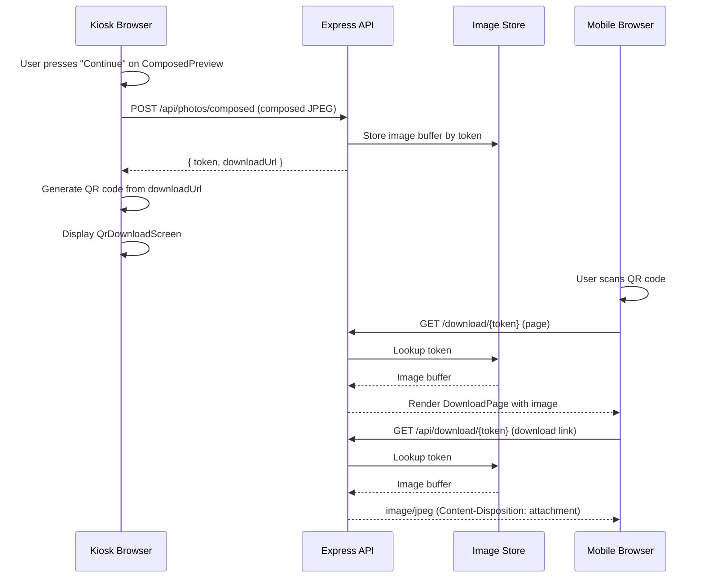

# User Story: 4 - Download Photo via QR Code

**As a** event attendee,
**I want** to scan a QR code displayed on screen to download my final branded photo to my phone,
**so that** I can receive my photo instantly without typing in an email or phone number.

## Acceptance Criteria

*   After the final image is generated, the app creates a unique, tokenized download URL for the image.
*   A QR code encoding the download URL is generated and displayed on screen.
*   The screen shows the final composed photo, the QR code, and a short instruction (e.g., "Scan this QR code to download your photo").
*   Scanning the QR code with a mobile device opens the download link and allows the user to save the image.
*   The download page works on common mobile browsers without requiring app installation.

## Notes

*   The experience should be contactless and fast to keep event queues short.
*   QR code should be sized large enough for easy scanning, especially on kiosk displays.
*   Link expiry and storage lifecycle are handled by a separate story.

## Implementation Plan

### 1. Feature Overview

**Goal:** After the composed branded photo is generated, the app uploads it to the server, generates a unique tokenized download URL, renders a QR code encoding that URL on screen alongside the composed photo, and provides a simple mobile-friendly download page so attendees can save their photo by scanning the QR code — no email, phone number, or app install required.

**Primary user role:** Event attendee (kiosk user).

---

### 2. Component Analysis & Reuse Strategy

| Component | Location | Decision | Justification |
|-----------|----------|----------|---------------|
| `ComposedPreview` | `components/features/compose-photo/ComposedPreview.tsx` | **Modify** | Currently shows composed image with Retake/Continue. The "Continue" action will now upload the composed image and transition to the QR screen instead of going to `done`. |
| `CapturedPhoto` type | `types/capture.ts` | **Reuse as-is** | Already has `composedDataUrl`, `composedId`, `composedUrl` fields reserved for Story 4. |
| `POST /api/photos` | `app/api/photos/route.ts` | **Reuse as-is** | Will be used for uploading the composed image JPEG blob. |
| `QrDownloadScreen` | — | **Create** | New component to display the QR code, composed photo thumbnail, and instructional text. |
| `DownloadPage` | — | **Create** | React page at `src/pages/DownloadPage.tsx` — the mobile-facing download page. |
| `POST /api/photos/composed` | — | **Create** | New API route to upload the composed JPEG and return `{ token, downloadUrl }`. |
| `GET /api/download/[token]` | — | **Create** | New API route to serve the image file for download by token. |

---

### 3. Affected Files

```
[CREATE] components/features/qr-download/QrDownloadScreen.tsx
[CREATE] components/features/qr-download/QrDownloadScreen.test.tsx
[CREATE] components/features/qr-download/QrDownloadScreen.visual.spec.ts
[CREATE] components/features/qr-download/QrDownloadScreen.e2e.spec.ts
[CREATE] app/api/photos/composed/route.ts
[CREATE] app/api/photos/composed/route.test.ts
[CREATE] app/api/download/[token]/route.ts
[CREATE] app/api/download/[token]/route.test.ts
[CREATE] app/download/[token]/page.tsx
[CREATE] app/download/[token]/page.test.tsx
[CREATE] types/download.ts
[MODIFY] app/capture/page.tsx
[MODIFY] types/capture.ts
```

---

### 4. Component Breakdown

#### New Components

**QrDownloadScreen**
- **Location:** `components/features/qr-download/QrDownloadScreen.tsx`
- **Type:** Client Component (`'use client'`) — needs canvas-based QR code generation and dynamic state.
- **Responsibility:** Displays the composed photo thumbnail, a generated QR code encoding the download URL, instructional text, and a "Done" / "Retake" action bar.
- **Props:**
  ```ts
  interface QrDownloadScreenProps {
    composedDataUrl: string;
    downloadUrl: string;
    onDone: () => void;
    onRetake: () => void;
  }
  ```
- **Children:** Canvas element for QR code (generated via a lightweight in-browser QR encoder — no external dependency needed since we can use a small inline QR generation utility, or add the ~3 KB `qrcode` npm package).
- **data-testid attributes:** `qr-screen-root`, `qr-screen-photo`, `qr-screen-qr-canvas`, `qr-screen-instruction`, `qr-screen-controls`, `qr-screen-done`, `qr-screen-retake`.

**DownloadPage (Server Component)**
- **Location:** `app/download/[token]/page.tsx`
- **Type:** Server Component — renders static HTML with the download link; no client interactivity needed beyond the native download button.
- **Responsibility:** Validates the token via an API call or direct lookup, displays the photo and a "Save Photo" button that triggers a browser download.
- **Props:** Receives `params.token` from the dynamic route.

#### Modified Components

**`app/capture/page.tsx`**
- Add `'qr-download'` to the `Step` union type.
- Add state for `downloadUrl`.
- After `handleComposed`, the `handleContinue` callback will upload the composed JPEG to `POST /api/photos/composed` and transition to `'qr-download'`.
- Render `QrDownloadScreen` in the `qr-download` step.

---

### 5. Design Specifications

No Figma link provided. Design follows the established project design system:

| Design Color | Semantic Purpose | Element | Implementation Method |
|--------------|-----------------|---------|------------------------|
| `#0B0F14` | Background | Page / card background | `bg-[#0B0F14]` |
| `#00E5FF` | Primary accent | QR border glow, Done button bg | `bg-[#00E5FF]`, `border-[#00E5FF]` |
| `#33ECFF` | Hover accent | Done button hover | `hover:bg-[#33ECFF]` |
| `#9AA4B2` | Secondary text | Instructional text, Retake button | `text-[#9AA4B2]` |
| `#FFFFFF` | Primary text | Heading text | `text-[#FFFFFF]` |

**Typography:**
- Heading ("Scan to Download"): `text-xl font-semibold text-[#FFFFFF]`
- Instruction text: `text-sm text-[#9AA4B2]`
- Button text: `text-base font-medium` / `font-semibold`

**Layout — QrDownloadScreen (portrait kiosk):**
```
┌──────────────────────────────────┐
│       Composed Photo (small)     │ ← max-h-[30vh], object-contain
│                                  │
│     ┌────────────────────┐       │
│     │                    │       │
│     │     QR Code        │       │ ← 256×256, white bg, 16px padding
│     │     (canvas)       │       │
│     │                    │       │
│     └────────────────────┘       │
│                                  │
│   "Scan this QR code to          │
│    download your photo"          │
│                                  │
│   [ Retake ]     [ Done ]        │
└──────────────────────────────────┘
```

**Layout — DownloadPage (mobile):**
```
┌──────────────────────────────────┐
│        DSAC Photo Booth          │
│                                  │
│     ┌────────────────────┐       │
│     │                    │       │
│     │    Full photo      │       │
│     │                    │       │
│     └────────────────────┘       │
│                                  │
│      [ Save Photo ⬇ ]           │
│                                  │
│   "Powered by DSAC Photo Booth"  │
└──────────────────────────────────┘
```

**Responsive:** The kiosk screen (`QrDownloadScreen`) is designed for the kiosk viewport (full-height). The download page (`/download/[token]`) must be responsive for common mobile widths (320–428px).

---

### 6. Data Flow & State Management

#### Types

**`types/download.ts` [CREATE]:**
```ts
export interface ComposedUploadResponse {
  token: string;
  downloadUrl: string;
}
```

**`types/capture.ts` [NO CHANGE]:**
Already has `composedId?` and `composedUrl?` — will be populated when the composed image is uploaded.

#### Data Fetching Strategy

1. **Composed image upload** — client-side `fetch('POST /api/photos/composed')` from `app/capture/page.tsx` after composition completes. Sends the composed JPEG blob in FormData. Receives `{ token, downloadUrl }`.
2. **Download page** — `app/download/[token]/page.tsx` (Server Component) receives `token` from the URL, calls `GET /api/download/[token]` internally (or validates token on server) to check token existence, then renders the download UI with an `<a href="/api/download/{token}" download>` link.
3. **QR code generation** — pure client-side canvas rendering in `QrDownloadScreen`. The `downloadUrl` is passed as a prop; no additional fetching needed.

#### State (in `app/capture/page.tsx`)

- `downloadUrl: string | null` — populated after composed image upload; passed to `QrDownloadScreen`.

#### Server-side Storage (Phase 1 Stub)

For Phase 1, composed images are stored in-memory using a `Map<string, Buffer>`. Phase 2 replaces this with persistent blob storage (S3, Vercel Blob, etc.). The Map is scoped to the API route module.

---

### 7. API Endpoints & Contracts

#### `POST /api/photos/composed`

**Route:** `app/api/photos/composed/route.ts`
**Method:** POST
**Content-Type:** `multipart/form-data`

**Request:**
| Field | Type | Required | Description |
|-------|------|----------|-------------|
| `file` | `File` | Yes | Composed JPEG image (max 10 MB) |

**Response (`201 Created`):**
```json
{
  "token": "a1b2c3d4-...",
  "downloadUrl": "https://host/download/a1b2c3d4-..."
}
```

**Error Responses:**
- `400` — Missing file, invalid MIME type, file too large
- `500` — Storage failure

**Server-side Logic:**
1. Validate file presence, MIME type (`image/jpeg`, `image/png`, `image/webp`), and size (≤ 10 MB).
2. Generate a cryptographically random token (`crypto.randomUUID()`).
3. Store the file buffer keyed by token (Phase 1: in-memory `Map`; Phase 2: blob storage).
4. Construct the download URL: `${origin}/download/${token}`.
5. Return `{ token, downloadUrl }`.

#### `GET /api/download/[token]`

**Route:** `app/api/download/[token]/route.ts`
**Method:** GET

**Response (`200 OK`):**
- `Content-Type: image/jpeg`
- `Content-Disposition: attachment; filename="dsac-photo.jpg"`
- Body: raw image bytes

**Error Responses:**
- `404` — Token not found or expired

**Server-side Logic:**
1. Look up token in the store.
2. If not found, return 404 JSON `{ error: "Photo not found or link has expired" }`.
3. If found, stream/return the image with appropriate headers for download.

---

### 8. Integration Diagram



---

### 9. Styling

**Color implementation — always direct hex values:**

| Property | Value | Tailwind Class |
|----------|-------|---------------|
| Page background | `#0B0F14` | `bg-[#0B0F14]` |
| QR canvas border/glow | `#00E5FF` | `border-[#00E5FF] shadow-[0_0_20px_rgba(0,229,255,0.3)]` |
| QR canvas background | `#FFFFFF` | `bg-[#FFFFFF]` |
| Done button bg | `#00E5FF` | `bg-[#00E5FF]` |
| Done button hover | `#33ECFF` | `hover:bg-[#33ECFF]` |
| Done button text | `#0B0F14` | `text-[#0B0F14]` |
| Retake button border | `#9AA4B2` | `border-[#9AA4B2]` |
| Instruction text | `#9AA4B2` | `text-[#9AA4B2]` |
| Heading text | `#FFFFFF` | `text-[#FFFFFF]` |

**Key Shadcn/ui components:** None — this project uses custom-styled elements consistent with the gaming/HUD aesthetic. Buttons follow the established rounded-full pattern.

**Responsiveness:**
- `QrDownloadScreen`: full viewport height (`h-dvh`), flex column, centered content.
- `/download/[token]` page: mobile-first, `max-w-md mx-auto`, responsive padding.

---

### 10. Testing Strategy

#### Unit Tests (Vitest)

| Test File | Tests |
|-----------|-------|
| `components/features/qr-download/QrDownloadScreen.test.tsx` | Renders QR canvas, photo, instruction, buttons; calls `onDone`/`onRetake`; passes `downloadUrl` to QR generator |
| `app/api/photos/composed/route.test.ts` | Validates file, rejects bad MIME/size, returns token+downloadUrl, stores image |
| `app/api/download/[token]/route.test.ts` | Returns image for valid token, 404 for invalid token, correct headers |
| `app/download/[token]/page.test.tsx` | Renders download button with correct href, shows photo, handles missing token |

#### Visual Tests (Playwright)

| Test File | Covers |
|-----------|--------|
| `components/features/qr-download/QrDownloadScreen.visual.spec.ts` | Colors, spacing, QR code visibility, layout at kiosk viewport |

#### E2E Tests (Playwright)

| Test File | Covers |
|-----------|--------|
| `components/features/qr-download/QrDownloadScreen.e2e.spec.ts` | Full flow: composed → continue → QR screen displayed → Done resets |

#### data-testid Attributes

- `qr-screen-root` — root container
- `qr-screen-photo` — composed photo thumbnail
- `qr-screen-qr-canvas` — the QR code canvas element
- `qr-screen-instruction` — instructional text
- `qr-screen-controls` — button container
- `qr-screen-done` — Done button
- `qr-screen-retake` — Retake button
- `download-page-root` — download page root
- `download-page-photo` — photo on download page
- `download-page-save-btn` — Save Photo button/link

---

### 11. Accessibility (A11y) Considerations

- The QR code canvas must have an `aria-label` describing its purpose (e.g., "QR code to download your photo").
- The instructional text should be associated with the QR code via `aria-describedby`.
- All buttons must have visible focus indicators (`focus-visible:ring-2 focus-visible:ring-[#00E5FF]`).
- The download page `<a>` link must have descriptive text ("Save Photo") — not just an icon.
- Ensure text contrast ratios meet WCAG AA: `#9AA4B2` on `#0B0F14` = 5.1:1 ✓, `#FFFFFF` on `#0B0F14` = 17.4:1 ✓.
- The download page should work without JavaScript (server-rendered `<a>` tag with `download` attribute).

---

### 12. Security Considerations

- **Tokenized URLs:** Download tokens use `crypto.randomUUID()` (UUIDv4, 122 bits of entropy) — not guessable.
- **No authentication bypass:** The download route only serves images it has stored; there is no path traversal or arbitrary file access.
- **Input validation:** The composed upload route validates MIME type and file size identically to the existing `POST /api/photos`.
- **Content-Disposition:** Download responses use `attachment` disposition to prevent the image from being rendered inline in a context where XSS could be injected.
- **Rate limiting (Phase 2):** Consider rate-limiting `POST /api/photos/composed` to prevent abuse.
- **Token expiry:** Handled by Story 5 (separate story). Phase 1 tokens persist until server restart (in-memory store).

---

### 13. Implementation Steps

**Implementation Checklist:**

**Phase 1: UI Implementation with Mock Data**

**1. Setup & Types:**
- [ ] Create `types/download.ts` with `ComposedUploadResponse` interface
- [ ] Install `qrcode` package (`npm i qrcode && npm i -D @types/qrcode`) for QR code generation on canvas

**2. QrDownloadScreen Component:**
- [ ] Create `components/features/qr-download/QrDownloadScreen.tsx`
- [ ] Implement QR code generation using `qrcode.toCanvas()` inside a `useEffect`
- [ ] Display composed photo thumbnail (`max-h-[30vh]`, `object-contain`)
- [ ] Display QR code canvas (256×256, white bg, cyan border glow)
- [ ] Display instruction text: "Scan this QR code to download your photo"
- [ ] Add Retake and Done buttons matching existing button style
- [ ] Add all `data-testid` attributes
- [ ] Test with a mock `downloadUrl` (e.g., `https://example.com/download/mock-token`)

**3. Page Flow Integration (mock upload):**
- [ ] Add `'qr-download'` to `Step` type in `app/capture/page.tsx`
- [ ] Add `downloadUrl` state variable
- [ ] Update `handleContinue` to simulate upload: set a mock `downloadUrl` and transition to `'qr-download'`
- [ ] Add `handleDone` callback that resets state and goes to `'camera'`
- [ ] Render `QrDownloadScreen` in the `qr-download` step
- [ ] Update `handleRetake` to clear `downloadUrl`

**4. Download Page (mock):**
- [ ] Create `app/download/[token]/page.tsx` as a Server Component
- [ ] Render page title "DSAC Photo Booth", photo placeholder, and "Save Photo" download link
- [ ] Style for mobile viewport with dark theme
- [ ] Add `data-testid` attributes

**5. UI Testing:**
- [ ] Write `QrDownloadScreen.test.tsx` — renders all elements, callback tests, QR canvas populated
- [ ] Write `app/download/[token]/page.test.tsx` — renders download link with correct href
- [ ] Create `QrDownloadScreen.visual.spec.ts` — color, spacing, layout verification at kiosk viewport
- [ ] Create `QrDownloadScreen.e2e.spec.ts` — flow from composed → QR screen → Done
- [ ] Manual testing: verify QR code scans correctly with a phone

**Phase 2: API Integration with Real Data**

**6. Composed Image Upload API:**
- [ ] Create `app/api/photos/composed/route.ts`
- [ ] Implement in-memory `Map<string, Buffer>` store (module-scoped)
- [ ] Implement POST handler: validate file → generate token → store buffer → return `{ token, downloadUrl }`
- [ ] Write `app/api/photos/composed/route.test.ts` — success, validation errors, size limit

**7. Download API Route:**
- [ ] Create `app/api/download/[token]/route.ts`
- [ ] Implement GET handler: lookup token → return image with download headers → 404 if missing
- [ ] Write `app/api/download/[token]/route.test.ts` — valid token, invalid token, correct headers

**8. Wire Real Upload in Page Flow:**
- [ ] Update `handleContinue` in `app/capture/page.tsx` to POST composed JPEG to `/api/photos/composed`
- [ ] Convert `composedDataUrl` to Blob for upload (using `fetch(dataUrl).then(r => r.blob())`)
- [ ] Set `downloadUrl` from API response
- [ ] Handle upload errors (show error, stay on composed step)
- [ ] Store `composedId` in `captured` state

**9. Wire Download Page to Real API:**
- [ ] Update `app/download/[token]/page.tsx` to validate token exists via server-side fetch
- [ ] Set `<a href="/api/download/{token}" download="dsac-photo.jpg">` for the save button
- [ ] Show error state if token is invalid/expired

**10. Integration Testing:**
- [ ] Update `QrDownloadScreen.e2e.spec.ts` to test full upload → QR → scan → download flow
- [ ] Test download page on mobile viewports in Playwright
- [ ] Verify QR code encodes the correct URL end-to-end

---

### References

- [types/capture.ts](types/capture.ts) — `CapturedPhoto` interface with `composedDataUrl`, `composedId`, `composedUrl`
- [app/api/photos/route.ts](app/api/photos/route.ts) — Existing photo upload API (pattern reference for validation)
- [components/features/compose-photo/ComposedPreview.tsx](components/features/compose-photo/ComposedPreview.tsx) — Current composed preview with Continue/Retake
- [app/capture/page.tsx](app/capture/page.tsx) — Main page flow orchestrator
- [docs/stories/05-expire-download-links.md](docs/stories/05-expire-download-links.md) — Related: token expiry handled separately
- [`qrcode` npm package](https://www.npmjs.com/package/qrcode) — Lightweight QR code generator with canvas support
